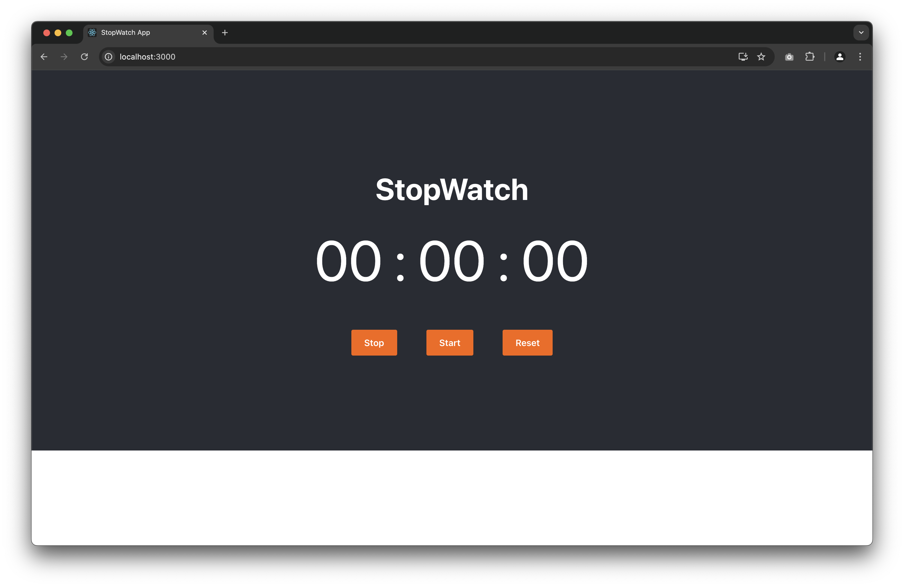

<div align="center">
    <h1>Stopwatch</h1>
</div>

<br />

## Overview

A Stopwatch web application is a simple yet useful tool that allows users to measure elapsed time with precision.


## Table of Contents

- [Features](#features)
- [Screenshots](#screenshots)
- [Installation](#installation)
- [Technologies Used](#technologies)
- [License](#license)
- [Contact](#contact)

## Features

This web-based stopwatch application provides a user-friendly interface for tracking time with start, stop, and reset functionality. Key features include:
 * Accurate Timing: Measures time in hours, minutes, seconds
 * Intuitive Controls: Easy-to-use buttons for starting, stopping, and resetting the timer
 * Responsive Design: Works seamlessly across desktop and mobile devices
 * Pause and Resume: Ability to pause the timer and continue from where it left off

## Screenshots



## Installation

### Step 1. Clone the repository:
  ```
git clone https://github.com/kumarmanuj/stopwatch.git
   ```
   
   
### Step 2. Navigate to the Project Directory: Change your current directory to the project directory:
  ```
   cd stopwatch
  ```

### Step 3. Install Dependencies: Install the required dependencies for the project using npm or yarn:
 ```
npm install
```

### Step 4. Start the Developement Server:
```
npm start
```
Runs the app in the development mode.\
Open [http://localhost:3000](http://localhost:3000) to view it in your browser.

The page will reload when you make changes.\
You may also see any lint errors in the console.


### Step 5. Test:
```
npm test
```

Launches the test runner in the interactive watch mode.\
See the section about [running tests](https://facebook.github.io/create-react-app/docs/running-tests) for more information.

### Step 6. Build:
```
npm run build
```

Builds the app for production to the `build` folder.\
It correctly bundles React in production mode and optimizes the build for the best performance.

The build is minified and the filenames include the hashes.\
Your app is ready to be deployed!

See the section about [deployment](https://facebook.github.io/create-react-app/docs/deployment) for more information.


## Technologies 
- React
- JavaScript
- Html
- CSS


## License
This project is licensed under the [MIT License](./LICENSE)


### Contact
For any inquiries or feedback, feel free to reach out:

- Email: [yomanuj@gmail.com](mailto:yomanuj@gmail.com)
- GitHub: [kumarmanuj](https://github.com/kumarmanuj)
